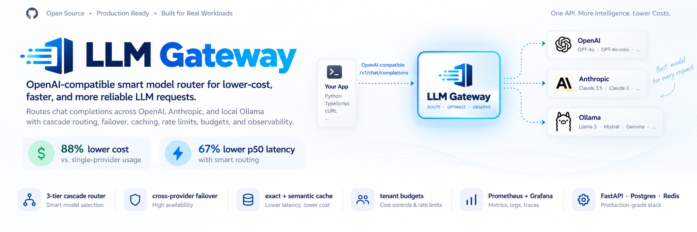
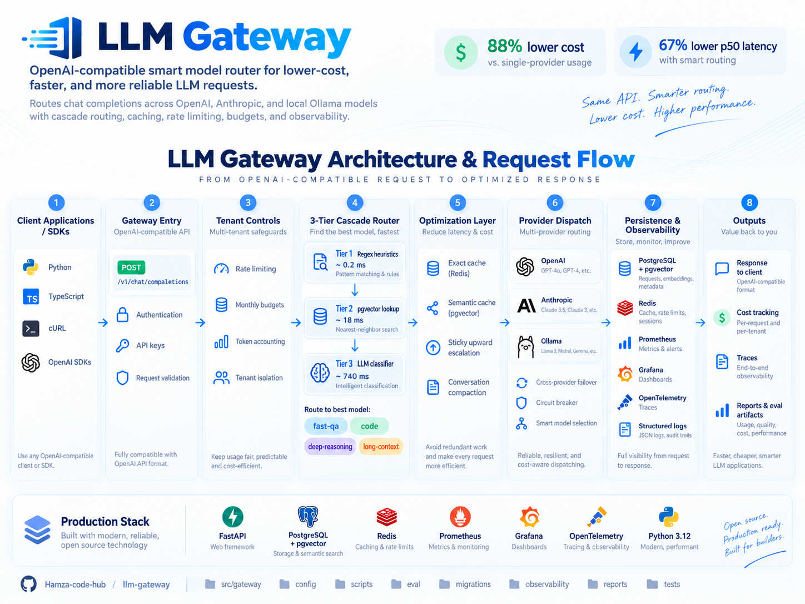
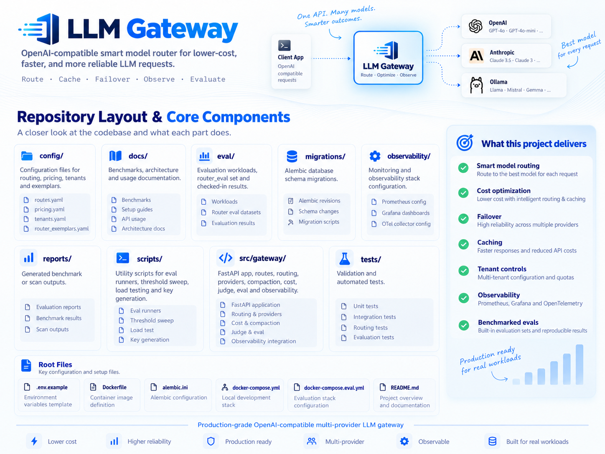

<p align="center">
  
</p>

<h1 align="center">LLM Gateway</h1>

<p align="center">
  <strong>OpenAI-compatible smart model routing for lower-cost, faster, and more reliable LLM requests.</strong>
</p>

<p align="center">
  Route chat completions across <strong>Anthropic</strong>, <strong>OpenAI</strong>, and <strong>local Ollama models</strong> through one API, with cascade routing, failover, caching, tenant controls, cost accounting, observability, and reproducible evaluation.
</p>

<p align="center">
  
  
  
  
  
  
</p>

---

## Overview

LLM Gateway is an **OpenAI-compatible HTTP gateway** that routes chat-completion requests across multiple LLM providers. Instead of binding an application to one model, the gateway evaluates each request and routes it to the lowest-cost model capable of handling the workload, while preserving stronger models for requests that need them.

The production path combines a **3-tier cascade router**, **cross-provider failover**, **exact and semantic caching**, **per-tenant rate limits and budgets**, **conversation compaction**, **cost tracking**, **Prometheus/Grafana/OpenTelemetry observability**, and a **benchmarked evaluation framework**.

### Headline benchmark

On the checked-in mixed realistic workload, `gateway:auto` matched the always-Opus quality ceiling while reducing both cost and median latency:

| Metric | `gateway:auto` | Always-Opus baseline | Result |
|---|---:|---:|---:|
| Cost / 23 calls | **$0.0275** | $0.2347 | **88% lower** |
| p50 latency | **1,011 ms** | 3,076 ms | **67% lower** |
| LLM-judge score | **1.000** | 0.992 | Comparable / slightly higher in this run |
| Judge pass rate | **100%** | 100% | Equal |

> These figures come from the repository's checked-in evaluation artifacts. The benchmark section below preserves the methodology, caveats, negative results, and unproven failure paths rather than hiding them.

---

## Why This Exists

A single-model integration is simple, but production LLM workloads are rarely uniform. Short factual queries, code generation, deep reasoning, long-context requests, and multi-turn conversations have different latency, quality, and cost requirements.

LLM Gateway provides one stable API surface while moving those decisions into infrastructure:

- **Route intelligently** — choose between `fast-qa`, `code`, `deep-reasoning`, and `long-context` paths.
- **Control spend** — track usage, enforce monthly tenant budgets, and avoid expensive models when they are unnecessary.
- **Reduce latency** — resolve simple requests with fast routing tiers and serve repeat traffic from cache.
- **Improve resilience** — dispatch across providers with configured fallbacks and circuit-breaker state.
- **Preserve compatibility** — keep the `/v1/chat/completions` interface expected by OpenAI-compatible clients.
- **Measure behavior** — evaluate routing accuracy, quality, latency, cost, load behavior, caching, and failure modes with checked-in artifacts.
- **Operate in production** — expose metrics, traces, structured logs, cost accounting, and operational dashboards.

---

## Architecture & Request Flow

<p align="center">
  
</p>

A request moves through the gateway in the following order:

1. **Client request** — an OpenAI-compatible client sends `POST /v1/chat/completions`, typically with `model: "auto"`.
2. **Gateway controls** — authentication, request validation, per-tenant rate limiting, token accounting, and monthly budget checks run before routing.
3. **Cascade routing** — progressively more expensive routing tiers classify the request.
4. **Cache / optimization layer** — the gateway checks exact cache, then semantic cache, and can compact long conversations.
5. **Provider dispatch** — the selected virtual route maps to Anthropic, OpenAI, or local Ollama, with configured fallbacks and circuit-breaker behavior.
6. **Persistence & observability** — request metadata, cost, metrics, logs, and traces are recorded.
7. **OpenAI-compatible response** — the result is returned to the caller through the same gateway API.

### Routing pipeline

```text
POST /v1/chat/completions  (model: "auto")
                    │
            ┌───────▼────────┐
            │ Auth + rate    │
            │ limit + budget │
            └───────┬────────┘
                    │
        ┌───────────▼────────────┐
        │    3-Tier Router       │
        │ T1 regex       ~0.2 ms │
        │ T2 pgvector NN   ~18 ms│
        │ T3 LLM classifier ~740ms│
        └───────────┬────────────┘
                    │
        fast-qa · code · deep-reasoning · long-context
                    │
      ┌─────────────▼────────────────┐
      │ Exact cache → Semantic cache │
      │ → provider dispatch          │
      │ → fallback / circuit breaker │
      └──────┬────────┬────────┬─────┘
             ▼        ▼        ▼
        Anthropic   OpenAI   Ollama
```

---

## Core Production Capabilities

### 1. Three-Tier Cascade Router

The router is a fallthrough cascade designed to spend the least routing time and money necessary for each decision:

| Tier | Mechanism | Measured p50 | Purpose |
|---|---|---:|---|
| **Tier 1** | Regex / heuristic rules | **~0.18–0.2 ms** | Resolve obvious routing cases immediately |
| **Tier 2** | pgvector nearest-neighbor lookup | **~18 ms** | Match against a curated exemplar corpus |
| **Tier 3** | LLM classifier | **~741 ms** | Classify ambiguous residual requests |

The production pgvector threshold is **0.45**, selected by a checked-in threshold sweep. Roughly **45%** of routing decisions resolve before the LLM classifier; only the remaining ~55% pay Tier-3 classification cost.

### 2. Sticky-Upward Conversation Escalation

Multi-turn conversations may escalate to a stronger model when later turns become more demanding, but the router does not silently downgrade an active conversation after escalation.

### 3. Exact + Semantic Cache

Two cache layers reduce repeated provider calls:

- **Exact cache:** Redis-backed response reuse for identical traffic.
- **Semantic cache:** pgvector similarity search for semantically related requests.

The benchmark suite records both positive and negative cache behavior; the current semantic threshold is intentionally discussed in the limitations section below.

### 4. Cross-Provider Failover & Circuit Breakers

Each virtual model can define fallback routes. Retryable statuses such as **408, 425, 429, and 5xx** trigger failover, while deterministic 4xx responses do not. Circuit-breaker state is tracked per `(provider, model)` and can be inspected through:

```text
/admin/breakers
```

The breaker state is also surfaced through Grafana.

### 5. Tenant Controls

Multi-tenant request controls include:

- API-key authentication
- Redis Lua token-bucket rate limiting
- Per-tenant monthly USD budgets
- Token accounting
- Tenant isolation through configuration

### 6. Conversation Compaction

Long conversations can be summarized with a cheaper model after crossing a configured token threshold, while the most recent turns remain verbatim.

### 7. LLM-as-Judge Evaluation

The evaluation framework supports a versioned judge prompt, single or ensemble judging, and an optional **1% production sampling backstop**.

### 8. Observability & Cost Accounting

The gateway emits and stores operational data through:

- **Prometheus** — metrics and alerting inputs
- **Grafana** — dashboards
- **OpenTelemetry** — distributed traces
- **Structured logs** — machine-readable request lifecycle logs
- **PostgreSQL** — per-request usage and cost accounting

---

## Supported Routing Targets

Applications can send a virtual model name instead of coupling themselves to a concrete provider model:

| Virtual model | Intended workload |
|---|---|
| `auto` | Let the cascade router select the route |
| `fast-qa` | Short / lower-complexity question answering |
| `code` | Code-oriented requests |
| `deep-reasoning` | High-reasoning workloads |
| `long-context` | Long-context workloads |

Concrete provider models may also be requested where configured.

---

## Technology Stack

| Layer | Technology |
|---|---|
| API gateway | FastAPI, Python 3.12 |
| Relational storage | PostgreSQL |
| Vector search | pgvector / HNSW |
| Cache & rate limiting | Redis |
| Providers | Anthropic, OpenAI, local Ollama |
| Metrics | Prometheus |
| Dashboards | Grafana |
| Tracing | OpenTelemetry |
| Schema migrations | Alembic |
| Runtime packaging | Docker Compose |
| Evaluation | Declarative workloads + router eval + LLM-as-judge |

---

## Quick Start

### 1. Configure environment variables

```bash
cp .env.example .env
```

Add the provider credentials you intend to use, such as `ANTHROPIC_API_KEY` and/or `OPENAI_API_KEY`.

### 2. Start the stack

```bash
docker compose up -d
```

The documented local stack exposes:

| Service | Address |
|---|---|
| Gateway | `http://localhost:8000` |
| Prometheus | `http://localhost:9090` |
| Grafana | `http://localhost:3000` |

### 3. Generate a gateway API key

```bash
python scripts/generate_key.py
```

Add the generated key hash to `config/tenants.yaml`.

### 4. Seed router exemplars

```bash
python scripts/seed_exemplars.py
```

This embeds the exemplar corpus used by Tier 2 routing.

### 5. Send a request

```bash
curl http://localhost:8000/v1/chat/completions \
  -H "Authorization: Bearer sk-gateway-..." \
  -H "Content-Type: application/json" \
  -d '{
    "model": "auto",
    "messages": [
      {
        "role": "user",
        "content": "What is the capital of France?"
      }
    ]
  }'
```

Any OpenAI-compatible client SDK can point its `base_url` at the gateway and use either a virtual model or a configured concrete model. A minimal chat UI is available at:

```text
/ui
```

---

## Configuration Model

Core routing and tenant behavior is configuration-driven:

```text
config/
├── routes.yaml              # virtual models and provider fallbacks
├── pricing.yaml             # model/provider pricing
├── tenants.yaml             # tenant keys, quotas, and budgets
└── router_exemplars.yaml    # curated routing exemplar corpus
```

This separates policy from gateway code so routing, provider choices, pricing, and tenant controls can evolve without rewriting the request pipeline.

---

## Benchmarks & Evaluation

Every reported number is traceable to a checked-in JSON or log artifact under `eval/results/`. Workloads live in `eval/workloads/`, router classification evaluation uses `eval/router_eval.yaml`, and the generated leaderboard is stored in `docs/benchmarks.md`.

A representative evaluation command is:

```bash
python -m gateway.eval \
  --workload <name> \
  --target gateway:auto \
  --target direct:openai:gpt-4o-mini \
  --judge claude-opus-4-7
```

### Evaluation integrity rules

- The **67-query router evaluation set is disjoint from the runtime exemplar corpus** to prevent trivial nearest-neighbor self-matches.
- The runner performs a **hash-collision check** between the two sets.
- Workloads are **fingerprinted** using a SHA over prompts plus version, so results are compared only across identical workloads.
- Direct-provider baselines remain visible even when they beat the gateway.

### Test 1 — Cost & Quality vs. Baselines

Mixed realistic workload: **20 prompts**, seeded as 50% short Q&A, 30% code, 15% multi-turn, and 5% long-context; **23 calls per target**.

| Target | Cost (23 calls) | p50 latency | Judge score | Judge pass |
|---|---:|---:|---:|---:|
| `gateway:auto` | **$0.0275** | **1,011 ms** | **1.000** | **100%** |
| `gateway:claude-opus-4-8` | $0.2347 | 3,076 ms | 0.992 | 100% |
| `direct:openai:gpt-4o-mini` | $0.0022 | 1,276 ms | 0.994 | 100% |

**Result:** auto-routing matched the always-Opus quality ceiling in this run at **88% lower cost** and **67% lower p50 latency**.

The cheap direct baseline is still materially cheaper: `gpt-4o-mini` was roughly **12× cheaper than auto**. The gateway's demonstrated value is therefore not "cheapest possible request"; it is selectively paying for stronger models when the router determines that a request needs them.

**Artifact:** `eval/results/resume_run/2026-06-19_mixed_realistic_*.json`

**Caveat:** this run used a single judge rather than an ensemble. The judge snapshot (`Opus 4-7`) was intentionally different from the deep-reasoning route (`Opus 4-8`) to reduce self-preference.

### Test 2 — Router Accuracy

The 67-query hand-labeled evaluation set was measured at the production embedding threshold of `0.45`.

| Metric | Result |
|---|---:|
| Overall accuracy | **98.5% (66/67)** |
| Tier 1 | **20/20**, p50 **0.18 ms** |
| Tier 2 | **10/10**, p50 **18 ms** |
| Tier 3 | **36/37**, p50 **741 ms** |
| Routing latency | p50 646 ms · p95 1,445 ms · p99 1,663 ms |

Per-category accuracy was 100% for `fast-qa`, `deep-reasoning`, and `long-context`; `code` measured 94.1%. The only misroute was a polarity-edge request: `"explain this — no code edits"`.

**Artifacts:**

```text
eval/results/resume_run/test2_router_baseline_t045.json
eval/results/2026-06-17_router_threshold_sweep.json
```

### Test 3 — Load & Rate Limiting

The load test primes the exact cache, then sends **200 requests per concurrency level**.

| Concurrency | RPS | p50 | p95 | p99 | 200s | 429s |
|---:|---:|---:|---:|---:|---:|---:|
| 1 | 20 | 50 ms | 53 ms | 60 ms | 200 | 0 |
| 4 | 76 | 50 ms | 61 ms | 67 ms | 200 | 0 |
| 16 | **205** | 64 ms | **170 ms** | 182 ms | 200 | 0 |
| 32 | 153 | 149 ms | 446 ms | 607 ms | 180 | 20 |
| 64 | 257 | 163 ms | 306 ms | 368 ms | 18 | 182 |

At concurrency 16, the gateway sustained **205 RPS** with **170 ms p95** and all requests returning 200. At higher concurrency, the configured **600 RPM** per-tenant Redis token bucket begins returning `429` with `Retry-After: 1`, which is expected limiter behavior.

> This is a cache-hit gateway-overhead benchmark. It does not represent cold provider latency.

**Artifact:** `eval/results/resume_run/test3_load.json`

### Test 4 — Cache Effectiveness

Two-pass workload: five prime questions plus five paraphrases routed to `fast-qa`.

**Repeat traffic:**

- 10/10 cache hits on pass 2
- p50 **3.1 ms** versus 961 ms cold
- **99.7% latency reduction**
- cached provider spend: **$0**

**Semantic-cache negative result:**

All five paraphrases missed the semantic cache on pass 1 at the current **0.95 cosine threshold** using MiniLM-L6-v2 embeddings. The result is retained because the threshold is currently too strict for that paraphrase workload.

**Artifacts:**

```text
eval/results/resume_run/2026-06-19_paraphrase_cache_*.json
eval/results/resume_run/test4_paraphrase_cache_pass2.json
```

### Test 5 — Chaos & Failure Modes

Infrastructure outages were injected with `docker pause`, with five requests issued during each outage.

| Scenario | Observed result | Current status |
|---|---|---|
| Redis outage | All 5 requests returned 200; cache and rate limiting degraded, latency rose from ~1.9 s to ~6.5 s | **Fail-open demonstrated** |
| Postgres outage | All 5 requests exceeded a 15 s client timeout | **Known defect** |
| Cross-provider failover | Mechanism is configured, but production logs recorded 0 failover events across 1,081 requests | **Implemented, not proven against a real outage** |
| Circuit breakers | Closed under healthy conditions; state is observable | **Open/half-open/close lifecycle not yet exercised end-to-end** |

**Artifacts:** `eval/results/resume_run/test5*.log`

---

## Current Reliability Status

The project intentionally distinguishes between **implemented**, **measured**, and **proven under failure** behavior.

### Demonstrated

- 98.5% router accuracy on the disjoint 67-query evaluation set
- Exact-cache repeat traffic at 3.1 ms p50 in the documented cache workload
- 205 RPS at concurrency 16 on the cache-hit path
- Redis outage fail-open behavior
- Cost and latency reduction on the mixed realistic workload

### Known limitations / open validation items

- Semantic-cache threshold `0.95` missed all paraphrases in the documented pass-1 workload.
- Postgres outage currently blocks the request path long enough for the 15 s test client to time out.
- Cross-provider failover is wired but was not triggered by a real provider outage in the observed 1,081-request production log.
- Circuit-breaker open → half-open → close behavior has not yet been exercised end-to-end in the documented chaos run.

This distinction is deliberate: **configured behavior is not presented as validated behavior until the evaluation artifacts demonstrate it.**

---

## Observability

Production visibility spans the complete request lifecycle:

```text
Client
  │
  ├── authentication / tenant
  ├── rate-limit decision
  ├── router tier + selected route
  ├── cache result
  ├── provider/model dispatch
  ├── fallback / breaker state
  ├── latency + token usage
  ├── estimated request cost
  └── final response status
```

The stack uses **Prometheus**, **Grafana**, **OpenTelemetry**, structured logs, and PostgreSQL-backed request/cost records so routing decisions can be inspected rather than treated as a black box.

---

## Repository Architecture

<p align="center">
  
</p>

```text
.
├── config/                    Routing, pricing, tenant, and exemplar configuration
├── docs/                      Architecture, benchmark, setup, and usage documentation
├── eval/                      Workloads, labeled router eval set, and result artifacts
├── migrations/                Alembic database migrations
├── observability/             Prometheus, Grafana, and OpenTelemetry configuration
├── reports/                   Generated evaluation / benchmark outputs
├── scripts/                   Evaluation, threshold, load-test, and key utilities
├── src/gateway/               FastAPI gateway implementation
├── tests/                     Automated validation and test coverage
├── .env.example               Environment variable template
├── .python-version            Python runtime declaration
├── Dockerfile                 Gateway container image
├── alembic.ini                Alembic configuration
├── docker-compose.yml         Local gateway stack
├── docker-compose.eval.yml    Evaluation stack
└── README.md                  Project overview and operating guide
```

### `src/gateway/`

The main application contains the FastAPI surface and the production request pipeline, including routing, providers, conversation compaction, cost handling, judging/evaluation, and observability integrations.

### `config/`

Configuration separates provider routing policy, pricing, tenant controls, and the exemplar corpus from runtime code.

### `eval/`

Contains declarative workloads, the hand-labeled 67-query router evaluation set, and run artifacts used to reproduce benchmark claims.

### `observability/`

Contains monitoring configuration for the Prometheus, Grafana, and OpenTelemetry stack.

### `migrations/`

Database schema evolution is managed through Alembic migrations.

---

## Evaluation Artifacts

The repository keeps benchmark evidence alongside the implementation rather than publishing numbers without traceability.

```text
eval/
├── workloads/                 Declarative benchmark workloads
├── router_eval.yaml           67-query hand-labeled routing set
└── results/                   JSON and log artifacts from evaluation runs

docs/
└── benchmarks.md              Generated benchmark leaderboard

scripts/
├── build_leaderboard.py       Builds benchmark leaderboard
└── ...                        Eval runners, threshold sweep, load testing, key generation
```

This allows routing accuracy, benchmark workloads, latency/cost results, caching behavior, and chaos-test observations to be inspected from repository artifacts.

---

## API Surface Highlight

### Chat completions

```http
POST /v1/chat/completions
Authorization: Bearer <gateway-key>
Content-Type: application/json
```

Use `model: "auto"` for smart routing or specify one of the configured virtual/concrete models.

### Circuit-breaker inspection

```http
GET /admin/breakers
```

### Minimal chat interface

```text
/ui
```

---

## Production Design Principles

The implementation and evaluation strategy are built around several explicit principles:

- **One client contract, multiple providers** — applications integrate once with the gateway.
- **Cheap decisions first** — route with heuristics/vector search before paying for an LLM classifier.
- **Escalate when needed** — preserve stronger models for workloads that justify them.
- **Do not hide negative results** — cache misses, chaos failures, and unproven paths remain documented.
- **Configuration over hard-coding** — virtual models, pricing, tenant policy, and exemplars live outside request code.
- **Observable routing** — model selection, breaker state, cost, latency, and request behavior are inspectable.
- **Reproducible evaluation** — benchmark claims point to versioned workloads and checked-in artifacts.

---

## License

This project is licensed under the **MIT License**.

---

<p align="center">
  <strong>One API. Multiple models. Smarter routing.</strong><br/>
  Route for quality, control cost, reduce latency, and keep provider decisions out of application code.
</p>
